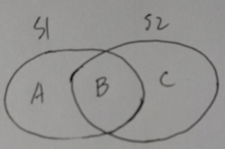

# 什么是布隆过滤器

以前有过这种需求，抽象来说就是：两个集合S1和S2，相交，求如下ABC三部分分别有哪些元素？

 

做法是：构造两个map，遍历。数据量小还可以，数据量大的话，就不可以了。直到看到“布隆过滤器”这个概念

## 定义

> Bloom Filter是1970年由Bloom提出的。它实际上是一个很长的二进制向量和一系列随机映射函数（Hash函数）。布隆过滤器可以用于检索一个元素是否在一个集合中。它的优点是空间效率和查询时间都远远超过一般的算法，缺点是有一定的误识别率和删除困难。Bloom Filter广泛的应用于各种需要查询的场合中，如Orocle的数据库，Google的BitTable也用了此技术。

## 特点

1. 不存在漏报（False Negative），即某个元素在某个集合中，肯定能报出来。
2. 可能存在误报（False Positive），即某个元素不在某个集合中，可能也被爆出来。
3. 确定某个元素是否在某个集合中的代价和总的元素数目无关。

# 实现

## java实现

[BloomFilter的Java实现](https://gitee.com/yysue/samples/blob/master/wheelwheel/src/main/java/com/samples/BloomFilter.java)

## c++实现

```c++
/*http://www.cnblogs.com/dolphin0520/archive/2012/11/10/2755089.html*/
/*布隆过滤器简易版本 2012.11.10*/

#include<iostream>
#include<bitset>
#include<string>
#define MAX 2<<24
using namespace std;

bitset<MAX> bloomSet;           //简化了由n和p生成m的过程 

int seeds[7]={3, 7, 11, 13, 31, 37, 61};     //使用7个hash函数 


int getHashValue(string str,int n)           //计算Hash值 
{
    int result=0;
    int i;
    for(i=0;i<str.size();i++)
    {
        result=seeds[n]*result+(int)str[i];
        if(result > 2<<24)
            result%=2<<24;
    }
    return result;
}


bool isInBloomSet(string str)                //判断是否在布隆过滤器中 
{
    int i;
    for(i=0;i<7;i++)
    {
        int hash=getHashValue(str,i);
        if(bloomSet[hash]==0)
            return false;
    }
    return true;
}

void addToBloomSet(string str)               //添加元素到布隆过滤器 
{
    int i;
    for(i=0;i<7;i++)
    {
        int hash=getHashValue(str,i);
        bloomSet.set(hash,1);
    }
}


void initBloomSet()                         //初始化布隆过滤器 
{
    addToBloomSet("http://www.baidu.com");
    addToBloomSet("http://www.cnblogs.com");
    addToBloomSet("http://www.google.com");
}


int main(int argc, char *argv[])
{
    
    int n;
    initBloomSet();
    while(scanf("%d",&n)==1)
    {
        string str;
        while(n--)
        {
            cin>>str;
            if(isInBloomSet(str))
                cout<<"yes"<<endl;
            else
                cout<<"no"<<endl;
        }
        
    }
    return 0;
}
```

# 应用

[如何生成数千万不重复的固定长度的字符串?](https://segmentfault.com/q/1010000002430143)

[一个实现](https://gitee.com/yysue/samples/blob/master/wheelwheel/src/main/webapp/samples/BloomFilterApp.html)

# 参考

> 网上大部分文章都是从下面这几篇文章中摘抄的。

1. [数学之美系列二十一 － 布隆过滤器（Bloom Filter）](https://china.googleblog.com/2007/07/bloom-filter_7469.html)
2. [布隆过滤器-维基百科](https://zh.wikipedia.org/wiki/%E5%B8%83%E9%9A%86%E8%BF%87%E6%BB%A4%E5%99%A8)
3. [布隆过滤器](http://www.cnblogs.com/dolphin0520/archive/2012/11/10/2755089.html)
4. [布隆过滤器(Bloom Filter)的Java实现方法](https://www.52jbj.com/rjbc/545858.html)
5. [Hash和Bloom Filter](http://www.sigma.me/2011/09/13/hash-and-bloom-filter.html)

