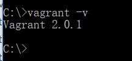
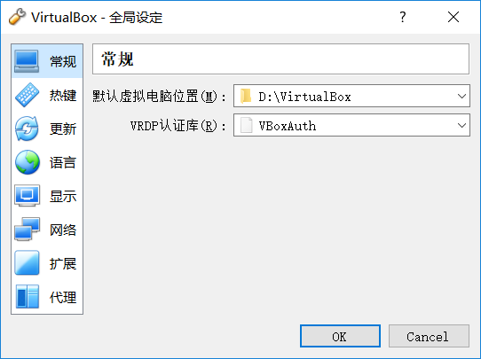
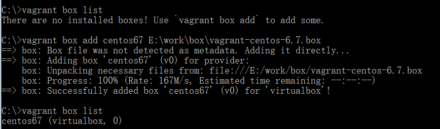
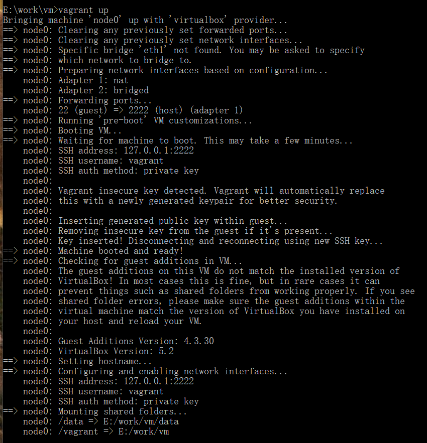

vagrant工具的使用介绍

# 准备

## 1.什么是vagrant?

1. Vagrant是一款用来构建虚拟开发环境的工具 
   官网地址：https://www.vagrantup.com

   box下载：http://www.vagrantbox.es

2. 基于ruby开发

3. 默认使用Oracle virtualbox作为虚拟化工具，需要打开机器的虚拟机支持
   

   解决：进入BIOS开启VT虚拟化 

## 2.vagrant命令介绍

```shell
# vagrant box add {title} {url}
# examples:
vagrant box add cnetos66 c:\work\vm\centos66_v2.box
vagrant box add https://github.com/2creatives/vagrant-centos/releases/download/v6.5.3/centos65-x86_64-20140116.box

vagrant init {title} # 生成配置文件
vagrant -h # 查看帮助
vagrant up # 启动虚拟机
vagrant ssh # 连接
vagrant status # 查看状态
vagrant halt # 关机
vagrant suspend # 相当于休眠
vagrant resume # 恢复
vagrant box list # 查看box文件
vagrant [-f] destory # 删除虚拟机
vagrant reload # 修改配置文件后，重启虚拟化开发环境

vagrant box list             # 列出当前导入的box
vagrant destory              # ***machine
vagrant box remove [name]    # 移除box
vagrant up [name]            # 启动machine                 
vagrant halt [name]          # 关闭machine 
vagrant status [name]        # 查看machine的状态

# 将虚拟机打包成box
vagrant package centos66 --output c:\work\box\centos_mysql.box
```

## 3.vagrant配置文件解读

1. 使用ruby的语法，迭代器遍历

2. 网络的三种配置模式

   ```shell
   # 较为常用是端口映射，就是将虚拟机中的端口映射到宿主机对应的端口直接使用 ，在Vagrantfile中配置：
   # guest: 80 表示虚拟机中的80端口， host: 8080 表示映射到宿主机的8080端口。
   # 宿主机端口 > 1024
   config.vm.network: "forwarded_port", guest: 80, host: 8080, protocol: "tcp/udp"

   # host only
   # 如果需要自己自由的访问虚拟机，但是别人不需要访问虚拟机，
   # 可以使用private_network，并为虚拟机设置IP ，在Vagrantfile中配置：
   # 192.168.1.120 表示虚拟机的IP，多台虚拟机的话需要互相访问的话，设置在相同网段即可
   config.vm.network: "private_network", ip: "192.168.1.120"

   # 如果需要将虚拟机作为当前局域网中的一台计算机，由局域网进行DHCP，那么在Vagrantfile中配置：
   config.vm.network: "public_network", ip: "192.168.1.120"

   # 共有网络，还可以支持网桥
   config.vm.netowrk "public_network", :bridge => 'eth1: SSID'
   ```

3. 文件目录共享

   ```shell
   config.vm.synced_folder "c:/work/vm", "/data"
   config.vm.synced_folder "./", "/data/web/apache_default/"
   ```

# 实践

## 安装vagrant

默认安装就可以(会添加vagrant安装目录下的bin目录加入到path)

验证安装

```shell
vagrant -v
```

 

## 安装virtualbox

VirtualBox-5.2.0-118431-Win.exe

默认安装就可以了

修改一下默认虚拟机位置

 

## 虚拟机->box

...

## box->虚拟机

下载box

```shell
# 从这个网站下载：http://www.vagrantbox.es/
# CentOS 6.7 x64 (Minimal, Puppet 4.2.3, Guest Additions 4.3.30)[notes]
https://github.com/CommanderK5/packer-centos-template/releases/download/0.6.7/vagrant-centos-6.7.box
```

新建工作目录并且切换到该目录下

```shell
mkdir E:\work\vm
cd E:\work\vm
```

添加镜像到Vagrant

```shell
# 添加镜像到Vagrant
vagrant box add centos67 E:\work\box\vagrant-centos-6.7.box
# 说明
# vagrant：vagrant的命令
# box：参数
# add：添加一个box镜像
# centos67：镜像名称
# E:\work\box\vagrant-centos-6.7.box：镜像的地址

# 查看镜像
vagrant box list
```

 

初始化配置

```shell
# 在当前工作目录下生成配置文件Vagrantfile
vagrant init centos67
# 说明
# centos67：镜像名称，如果只有一个可省略
```

配置文件

```ruby
# -*- mode: ruby -*-
# vi: set ft=ruby :

Vagrant.configure("2") do |config|
	config.vm.define :node0 do |node0|
		node0.vm.provider "virtualbox" do |v|
			v.customize ["modifyvm", :id, "--name", "node0", "--memory", "1024"]
		end
		node0.vm.box = "centos67"
		node0.vm.hostname = "node0"
		node0.vm.network :public_network, ip:"192.168.5.150", bridge: "eth1"
		node0.vm.synced_folder "data", "/data"
		node0.vm.synced_folder "E:\\git_home\\book\\2017\\Cpp_Primer\\samples", "/work"
	end
end
```

> **说明**
>
> 1. 这是ruby的语法
> 2. `Vagrant.configure("2")` ：2是版本的意思
> 3. `|config|、|node0|、|v|` ：变量的意思
> 4. `v.gui = true`  ：virtualbox的界面也会启动

管理虚拟机

```shell
# 启动
vagrant up

# 查看状态
vagrant status

# 停止
vagrant halt

# 释放
vagrant destory

# 查看已加载的box
vagrant box list

# 打包虚拟机
vagrant package centos67 --output e:\work\vm\centos_mysql.box --base node0 --vagrantfile Vagrantfile 

# 说明：
# 如果网络模式中使用 private_network 的话，在打包之前需要清除一下private_network的设置，避免不必要的错误：
# sudo rm -f /etc/udev/rule.d/70-persistent-net.rules
```

 

# 参考：

1. [官方文档](https://www.vagrantup.com/docs/)
2. [Getting Started](https://www.vagrantup.com/intro/getting-started/index.html)
3. [搭建Linux工作环境之Vagrant](https://zhuanlan.zhihu.com/p/20791590)
4. [使用vagrant+VirtualBox搭建代码建调试环境](https://zhuanlan.zhihu.com/p/21330080)
5. [使用vagrant部署开发环境](https://www.cnblogs.com/wangkongming/p/4301021.html)
6. [使用Vagrant在Windows下部署开发环境](https://blog.smdcn.net/article/1308.html)
7. [创建自己的Vagrant box](http://www.cnblogs.com/davenkin/p/create-own-vagrant-box.html)