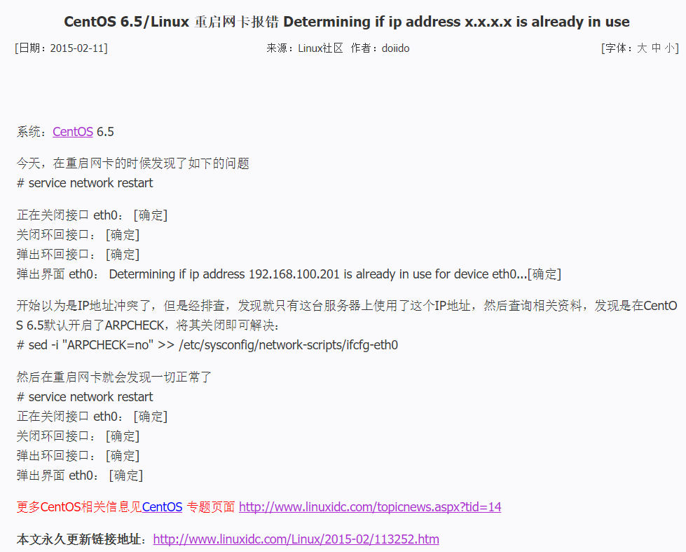

# 操作

## 安装虚拟机

创建工作目录并添加box

```shell
mkdir E:\work\vm_mysql
cd E:\work\vm_mysql

vagrant box add centos66_v2 E:\work\box\centos66_v2.box
```


初始化配置
```shell
vagrant init centos66_v2
```


Vagrantfile

 

修改配置文件Vagrantfile

```ruby
# -*- mode: ruby -*-
# vi: set ft=ruby :

app_servers = {
	:node141 => '192.168.5.141', 
	:node142 => '192.168.5.142', 
	:node143 => '192.168.5.143', 
	:node144 => '192.168.5.144', 
}

Vagrant.configure("2") do |config|
	config.vm.box = "centos66_v2"

	app_servers.each do |app_server_name, app_server_ip|
		config.vm.define app_server_name do |app_config|
			app_config.vm.provider "virtualbox" do |v|
				v.customize ["modifyvm", :id, "--name", app_server_name.to_s, "--memory", "1024"]
			end
			app_config.vm.hostname = "#{app_server_name.to_s}.vagrant.internal"
			app_config.vm.network :public_network, ip: app_server_ip, bridge: "eth1"
			app_config.vm.synced_folder "#{app_server_name.to_s}_data", "/data"
			app_config.vm.synced_folder "soft", "/soft"
		end
	end
end
```

配置文件说明

1. 4个虚拟机，name是node[1-4]，ip是192.168.5.14[1-4]

启动虚拟机

```shell
vagrant status

# 启动所有
vagrant up

# 单独启动一个
vagrant up node141
```


## 安装MySQL

1. 下载
2. 解压

  ```shell
  sudo su -
  cd /soft/__db/mysql
  mkdir -p /opt/mysql
  tar -xzvf mysql-5.6.37-linux-glibc2.12-x86_64.tar.gz -C /opt/mysql/
  unlink /usr/local/mysql
  ln -s /opt/mysql/mysql-5.6.37-linux-glibc2.12-x86_64 /usr/local/mysql
  cp /usr/local/mysql/support-files/mysql.server /etc/init.d/mysql
  ```

3. 创建用户

  ```shell
  groupadd mysql
  useradd -g mysql -s /sbin/nologin -M mysql
  ```

4. 环境变量

  ```shell
  echo 'export PATH=/usr/local/mysql/bin:$PATH' >> /etc/profile
  source /etc/profile
  ```

5. 创建必须的目录
  ```shell
  mkdir -p /data/mysql/mysql3376/{data,tmp,logs}
  ```
6. 修改权限 
  ```shell
  chown -R mysql:mysql /data/mysql/mysql3376
  chown -R mysql:mysql /opt/mysql
  chown -R mysql:mysql /usr/local/mysql
  ```
7. 配置文件my.cnf

  ```pro
  [mysqld]
  port = 3376

  basedir = /usr/local/mysql
  datadir = /data/mysql/mysql3376/data
  socket = /tmp/mysql3376.sock
  tmpdir = /data/mysql/mysql3376/tmp
  log-bin = /data/mysql/mysql3376/logs/mysql-bin
  innodb_data_home_dir = /data/mysql/mysql3376/data
  innodb_log_group_home_dir = /data/mysql/mysql3376/logs
  log-error = /data/mysql/mysql3376/logs/error.log

  user=mysql
  # Disabling symbolic-links is recommended to prevent assorted security risks
  symbolic-links=0
  innodb_data_file_path=ibdata1:100M:autoextend

  [mysqld_safe]
  # log-error=/data/mysql/mysql3376/error.log
  # pid-file=mysqldb.pid
  # malloc-lib = /usr/local/mysql/lib/mysql/libjemalloc.so
  ```
8. 初始化

  ```shell
  cd /usr/local/mysql
  ./scripts/mysql_install_db
  ```

## 生成box

[CentOS6.x安装后的设置](https://gitee.com/yysue/tutorial/blob/master/contents/linux/docs/2017-10-30-centos6.x-setting.md)

```shell
# 如果网络模式中使用 private_network 的话，
# 在打包之前需要清除一下private_network的设置，避免不必要的错误：
# 不管是不是private_network，建议都要清除一下
rm -f /etc/udev/rules.d/70-persistent-net.rules
# or
>/etc/udev/rules.d/70-persistent-net.rules

# 避免后面遇到后面提到的问题
sed -i '/UUID/d' /etc/sysconfig/network-scripts/ifcfg-eth0
sed -i '/HWADDR/d' /etc/sysconfig/network-scripts/ifcfg-eth0
sed -i "$ a ARPCHECK=no" /etc/sysconfig/network-scripts/ifcfg-eth0

# 关闭当前操作的虚拟机
shutdown -h now
vagrant halt 

vagrant package node142 --output e:\work\box\centos66_v2_mysql.box
```


## 再配置vagrant

再添加mysql box

```shell
vagrant box add centos66_v2_mysql E:\work\box\centos66_v2_mysql.box
```

修改Vagrantfile

```ruby
config.vm.box = "centos66_v2"
改成
config.vm.box = "centos66_v2_mysql"
```

重新加载

```shell
vagrant reload
```

## 启动MySQL

4个虚拟机，启动前需要初始化数据/data


# 遇到的问题

1. CentOS 6.5/Linux 重启网卡报错 Determining if ip address x.x.x.x is already in use

    

2. 用户没有权限

   

   原因是/tmp权限被修改了

   ```shell
   chmod a+rwx,o+t /tmp
   ```