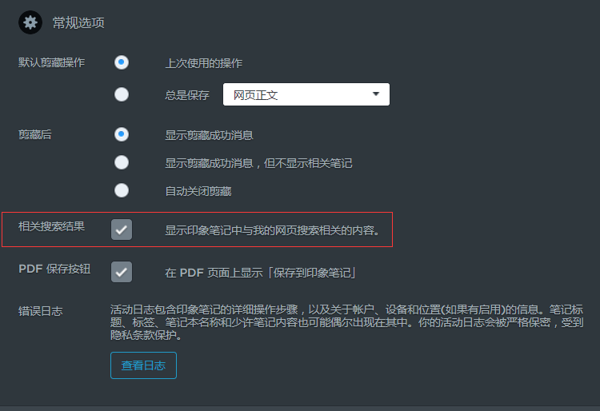

# best practise

1. **Ctrl + q 搜索快捷键**

2. **保存常用搜索**

   Windows：文件 -> 新建已保存搜索条件

   Mac：编辑 -> 搜索 -> 保存搜索

3. **使用标签搜索**

   tag:Java

4. **按创建或更新时间搜索**(created创建时间，updated更新时间)

   1. 今天：created:day
   2. 昨天：created:day-1 -created:day
   3. 最近7天：created:day-7
   4. 本周：created:week
   5. 最近一周：created:week-1
   6. 本月：created:month
   7. 最近一月：created:month-1
   8. 本年：created:year
   9. 去年今天：created:day-365 -created:day-364
   10. 某天(20170526)： created:20170526 -created:20170527

5. **待办清单**：搜索有复选框的笔记

   todo:true

   todo:false

   todo:*

6. **查询移动客户端创建的笔记**

   source:mobile

7. **搜网络，搜笔记**

   在Chrome插件[印象笔记·剪藏]中设置

    

# refer
[搜索语法](https://dev.yinxiang.com/doc/articles/search_grammar.php)

