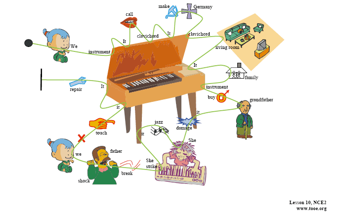
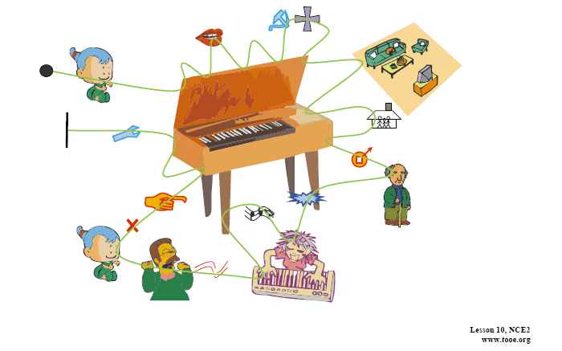

new concept english

新概念英语第二册第10课：Not For Jazz 不适宜弹爵士乐

读图方法：从实心圆点开始，顺着曲线念，一直到该曲线终结为止。观察带有文字的图大约三到五遍，即可利用不带文字的思维导图进行复述甚至背诵。

特别提示：用图忆背课文，可分为四个步骤：识图、复述、忆图和背诵课文。

MP3和讲解看这里：

http://www.tingclass.net/list-5044-1.html

本课看这里：

http://www.tingclass.net/show-5044-772-1.html

# 课文原文

> We have an old musical instrument. It is called a clavichord. It was made in Germany in 1681. Our clavichord is kept in the living room. It has belonged to our family for a long time. The instrument was bought by my grandfather many years ago. Recently it was damaged by a visitor. She tried to play jazz on it! She struck the keys too hard and two of the strings were broken. My father was shocked. Now we are not allowed to touch it. It is being repaired by a friend of my father’s.

## 分句背诵

1. We have an old musical instrument. 
2. It is called a clavichord. 
3. It was made in Germany in 1681. 
4. Our clavichord is kept in the living room. 
5. It has belonged to our family for a long time. 
6. The instrument was bought by my grandfather many years ago. 
7. Recently it was damaged by a visitor. 
8. She tried to play jazz on it!
9. She struck the keys too hard and two of the strings were broken. 
10. My father was shocked. 
11. Now we are not allowed to touch it. 
12. It is being repaired by a friend of my father’s.

# 看图背诵

 

# 参考译文

> 我家有件古乐器，被称作古钢琴，是1681年德国造的。我们的这架古钢琴存放在起居室里。我们家有这件乐器已经很久了， 是我祖父在很多年以前买的。可它最近被一个客人弄坏了，因为她用它来弹奏爵士乐。她在击琴键时用力过猛，损坏了两根琴弦。我父亲大为吃惊，不许我们再动它。父亲的一个朋友正在修理这件乐器。

## 分句翻译

1. 我家有件古乐器，
2. 被称作古钢琴，
3. 是1681年德国造的。
4. 我们的这架古钢琴存放在起居室里。
5. 我们家有这件乐器已经很久了， 
6. 是我祖父在很多年以前买的。
7. 可它最近被一个客人弄坏了，
8. 因为她用它来弹奏爵士乐。
9. 她在击琴键时用力过猛，损坏了两根琴弦。
10. 我父亲大为吃惊，
11. 不许我们再动它。
12. 父亲的一个朋友正在修理这件乐器。

# 看图回忆

 