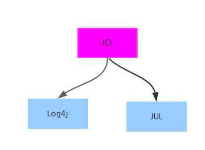
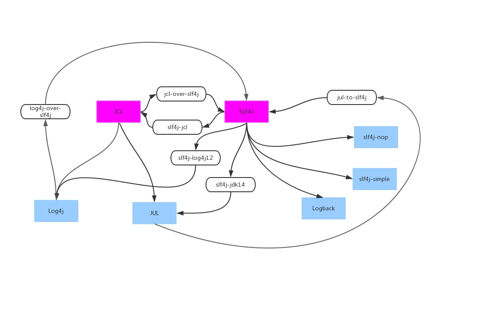
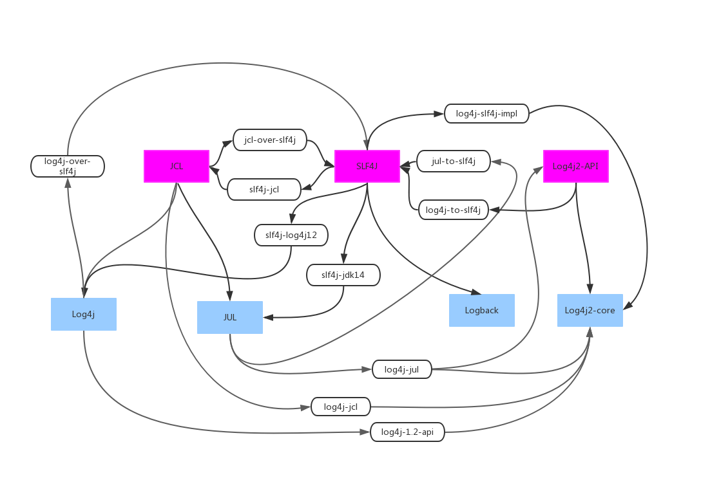

# Log Facade

JCL(Commons Logging)

# Log Implementation

JUL(Java Util Log)

Log4j(The Simple Logging Facade for Java)

Logback

Log4j2

Java日志全解析(上) - 源流 https://zhuanlan.zhihu.com/p/24272450
Java日志全解析(下) - 最佳实践 https://zhuanlan.zhihu.com/p/24275518
jdk-logging、log4j、logback日志介绍及原理 https://my.oschina.net/pingpangkuangmo/blog/406618

 

 

  