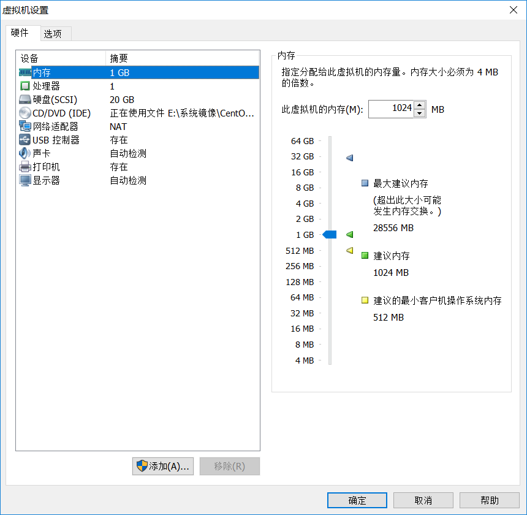

CentOS6.x安装与配置

# 环境准备

宿主机:64位Windows10

镜像:CentOS-6.8-x86_64-bin-DVD1.iso

虚拟机:VMware 12.5.6 build-5528349

# 虚拟一台机器

选择Linux-->CentOS64位，其他默认即可

CPU 1核 

内存 1G

硬盘 20G

 

 # 安装系统

1. 添加镜像
2. 开启虚拟机
3. 是否检查光盘，按TAB键，选Skip，Enter

