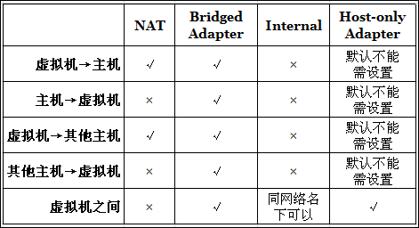

# 4种网络接入模式

NAT 网络地址转换模式(NAT,Network Address Translation)

Bridged Adapter 桥接模式

Internal 内部网络模式

Host-only Adapter 主机模式

 

VirtualBox配置页面

 

 ## NAT

 

  

## Bridged

  

## Internal

## Host-only

 