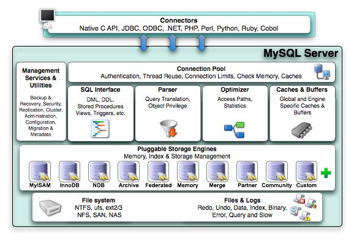

# MySQL体系结构

## 架构图




> 接入层：负责认证，每个连接是一个线程，分配PGA
> Server层的核心处理层 包括：SQL接口，解析，优化，Cache/buffer
> 存储引擎
> 文件系统 推荐文件系统 xfs

## MySQL都有哪些日志

1. error log 错误日志 

   ```shell
   看[ERROR]和[WARNING]
   ```

2. general log

   > 默认没有打开
   > 分析mysqldump的原理
   > mydumper
   > innbackupex的原理
   >
   > ```shell
   > # 全局
   > set global general_log=on
   >
   > # session
   > set general_log=on
   >
   > # 查看
   > show global variables like "%general%";
   > datadir/`hostname`.log
   > ```

3. binary log

   > 所有写操作都会在binary log中记录
   > 数据库的复制也是使用的binary log
   > https://github.com/wubx/mysql-binlog-statistic

4. slow log

   > long_query_time = 10s
   > 建议改成1s
   > DML:INSERT,UPDATE,DELETE在处理中锁等待的时间不记录
   > SELECT锁等待的时间会记录
   > execute_time > long_query_time
   > execute_time不包含DML中的锁等待时间

https://bugs.mysql.com

## Linux源码

> 没有目的的看源码没有产出
> 拿错误日志搜源码，不一定看源码，看附近的注释

# MySQL里的对象

> 数据库
> 表--->字段/索引
> 存储过程
> 触发器
> 事件
> ...

## 了解及创建表

```sql
-- 查看当前有哪些数据库
show databases;
information_schema 字典库
performance_schema 性能相关的字典库

-- 创建数据库
create database wubx;

-- 创建的数据库对应datadir下的一个目录
/data/mysql/mysql3376/data/wubx


mysql里view当成Tb对待了
MySQL是一个面向存储引擎解决方案的DB

show engines;
inforbright/InfiniDB/Spider/dblink:connect
OLTP环境：InnoDB

对于内存表，数据库重启时，系统会自动发起一个truncate table mem_tb
对于内存表，在复制中最好忽略

mysql.server->mysqld_safe->mysqld

MySQL里，每个连接都是一个线程
一个系统的并发度是有限的
线程数太多，反而系统的处理能力下降
随着连接数上长，反而性能下降

版本对应的最大连接数
5.1 64
5.5 128
5.6 200
5.7 200,300

一个问题：
LVS持5台WEB，后端：1组Cache3组DB
单组DB连接数达6千多
1.引入中间件kingshard
2.thread-pool 在percona,mariadb属于自带的免费的

```

# Data Types

https://dev.mysql.com/doc/refman/5.6/en/storage-requirements.html

> 数据类型
>
> 为了数据库跑的更快，选择一个合适的数据类型
> 实质是：节省IO
> 所有的SQL调优99%都是节省IO
>
> IOPS (Input/Output Operations Per Second)，即每秒进行读写（I/O）操作的次数
> 15000转/分的硬盘，每秒250次+换道延迟--->每秒150
>
> pic卡 10-45w IOPS
>
> 一个InnoDB的Page16K
> 文件系统里一个block4k
> 机械硬盘一个扇区512byte
>
> raid卡缓存在工作
> raid卡装电池
>
> 每个类型占用多少字节
> 做容量规划要用，如果将来需要我们计算行长，就需要了

## Best Practice

> 能不用浮点型就不要用
> 不是科研场景，基本用不到float

1. 百分比

   > 用decimal
   > 可以转成int

2. 坐标

   > 有替代方案
   > 转成地图位图信息

3. 金额

   > 不建议用
   > 转化成分保存成整数

4. 推荐datetime来替换timestamp

5. 数据库别去存图片

   > fastdfs 5.0
   > ceph
   > tfs
   > facebook heystack
   >
   > emoji 可存，utf8mb4

6. not null default ''

7. ​

## Numeric Types


### Integer Types

> age int(3)/age int(1)/int(20)
> int(n)
> n表示显示宽度
> zerofill
> zerofile
>
> int做自增主键是不是太小了
> int做主键？只增不删
> bigint做主键？(单表能支撑42亿数据？)大量写大量删
>
> 注意：
> 类型的溢出

### Fixed-Point Types

> 固定小数点类型
> decimal(M,N)
> M表示最大长度，也指字节
> N表示小数点后的位数
>
> 金额全部以分为单位存储
> 浮点数建索引不能进行等于操作
> 用区间的形式查询
>
> decimal(10,0)的替代方案int(10)

### Floating-Point Types

> 浮点数类型
> 浮点数不能进行等号比较
> 浮点数的运算比别人多几步
>
> 1.1二进制怎么表示呢
> 1.1+1.1呢

## Date Type


下图仅供参考


### timestamp

> the range for `TIMESTAMP`values is `'1970-01-01 00:00:01.000000'` to `'2038-01-19 03:14:07.999999'`.
> default 'null'

## String Type


### char&varchar

1. 定长，变长

2. 存储长度 

   > char 255 
   > varchar 65533+2长度标记(单位bytes)
   > 测试最大长度是65532

3. char没有额外开销，varchar有额外开销

4. char

   > 实际分配的长度是：M*字符编码的长度 等于存储空间
   > char(M)：M表示字符数
   > latin1 一个字符就占1个字节
   > utf8 一个字符占3个字节
   > 中文汉字在utf8占3个字节
   > 255*3=765bytes

5. varchar

   > 看上图说明
   > eg:
   > varchar(200)utf8编码，实际占用存储空间为 `200*3+2`
   > varchar(64)utf8编码，实际占用存储空间为`64*3+1(64*3=192<=255)`

6. char和varchar对空格的处理
   

   > 一般使用InnoDB
   > InnoDB本身就是一个变长存储
   > trx_id,row-id,rollback,filed_pointer,null-flag,field1,...
   > 数据库调优：节省IO
   > InnoDB 推荐varchar
   > MyISAM这种堆表，char定长分配会更快一点

### text

> 存储空间：2^16 select pow(2,16)

**char&varchar与text区别**

> 全文索引
> text不能有default值
> varchar>255byte和text处理一样
> group by和order by都不会用text类型的索引

### blob

> select pow(2,32)/1024/1024/1024

# 创建一张表有什么依据

## 基础知识

> 要有东西落地，先做出东西来
> 最小最合适原则，减少IO
> 原则 ：快，反3nf
>
> 保持表的行宽尽可能的小
> 表的字段数小
> 大的字段拆分，用主键做关联
>
> 避免`select *`
> 用啥字段select啥字段
> text类型的字段在查询时会先存储前20个字节到当前行，后面20字节另外存储
> 导致一个问题：访问一行数据，顺序IO读取-->随机IO读取
> overflow page,
>
> not null default ''
> 少一个字节
> innodb对NULL列需要下个额外标识
> NULL影响索引
>
> 推荐 整数自增列做PK

select count(*),count(1),count(col) from tb; 有啥区别

> count(*)=count(1)
> count(col)会忽略NULL值
> 推荐count(*) 走主键和second index

为什么索引会对SQL有优化呢

>B+tree
>索引定义：一组有序的数据结构
>排序实现：代码实现？？？
>建索引过程->就是排序
>
>聚集索引：
>ICT index cluster table  索引聚集表
>数据以聚集索引排序存储
>聚集索引和数据一块存储

InnoDB哪个索引算是聚集索引？

> 1. 主键 pk
> 2. 第一个唯一索引
> 3. 内部生成一个 rowid 6type


B+tree是面向行还是page

> InnoDB的b+tree面向page
> InnoDB是面向行存储的
> Page最少要有两行记录

## 索引列问题

什么样的字段加索引

> 区别度高，主键区别度100%
> 变化少的

区别度大于多少才适合做索引？

> 计算方法：`select distinct(col)/count(col) from tab;`
> \>30%

变化少的

> 索引列尽可能少更新

## 最怕

> 业务梳理不清楚
> 业务变化

## 三范式

> 属性不可分割
> 行的唯一性，每行一个主键
> 列不重复，在主键的基础下引入关系表，外键，空间换时间

## 创建一个集群

> master/slave
> mha
> pxc
> group_id,group_name,port,admin_user,admin_password,last_update
>
> 线上环境推荐，每一组数据的端口号都是一样的，同一组数据库使用一个端口号

## 步骤

1. 先了解业务
2. 对象梳理出来
3. 不同的业务表用不同的前缀区分

# 实践

## 测试自增主键溢出了

> 结论：自增主键溢出报Dumplicate entry(主键重复)错误

```sql
create table t1(id int not null auto_increment, name varchar(32), primary key(id));

insert into t1(id,name) values(pow(2,31),'wubx');

mysql> insert into t1(name) values ('test overflow');
ERROR 1062 (23000): Duplicate entry '2147483647' for key 'PRIMARY'
mysql> 
```

## 验证［浮点数不能进行等号比较］

> 结论：
>
> 1. 浮点数永远是一个近似值 
> 2. 指定精度可以进行等号比较了

```sql
drop table if exists t1;
-- 不指定精度
create table t1(f float(2));
insert into t1 values(1.234);
insert into t1 values(5.678);

select f from t1 where f=5.68;
select f from t1;

-- 指定精度 3,2 表示最大存储范围为[-9.99,9.99]
create table t1(f float(3.2));

```

## 测试char/varchar最大存储长度

> 结论见上述总结

```sql
drop table if exists t1;
create table t1(name varchar(65533)) charset=latin1 engine=innodb;
-- result
ERROR 1118 (42000): Row size too large. The maximum row size for the used table type, not counting BLOBs, is 65535. This includes storage overhead, check the manual. You have to change some columns to TEXT or BLOBs

create table t1(name varchar(65533)) charset=latin1 engine=innodb;
-- result
Query OK, 0 rows affected (0.01 sec)

drop table if exists t2;
create table t2(name char(255)) charset=latin1 engine=innodb;
-- result
Query OK, 0 rows affected (0.00 sec)

insert into t2 values(repeat('a', 255));
insert into t2 values(repeat('汉', 255));

drop table if exists t3;
create table t3(name char(255)) charset=utf8 engine=innodb;
insert into t3 values(repeat('a', 255));
insert into t3 values(repeat('汉', 255));

```

## 测试char/varchar对空格的处理

> 结论见上述总结

```sql
create table t1(v varchar(4), c char(4));
insert into t1 values('','');
insert into t1 values('ab','ab');
insert into t1 values('abcd','abcd');
insert into t1 values('abcdefg','abcdefg');
SELECT CONCAT('(', v, ')'), CONCAT('(', c, ')') FROM t1;
```

# 提问

## char&varchar与text的区别

## 三范式


# Else

> mysql workbench
> ER图
> icaba爱词霸