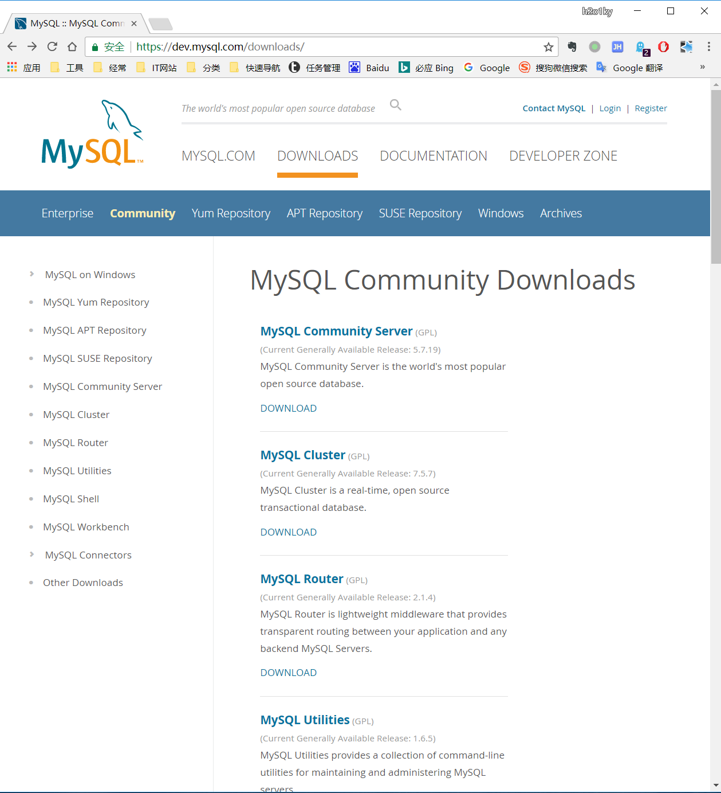
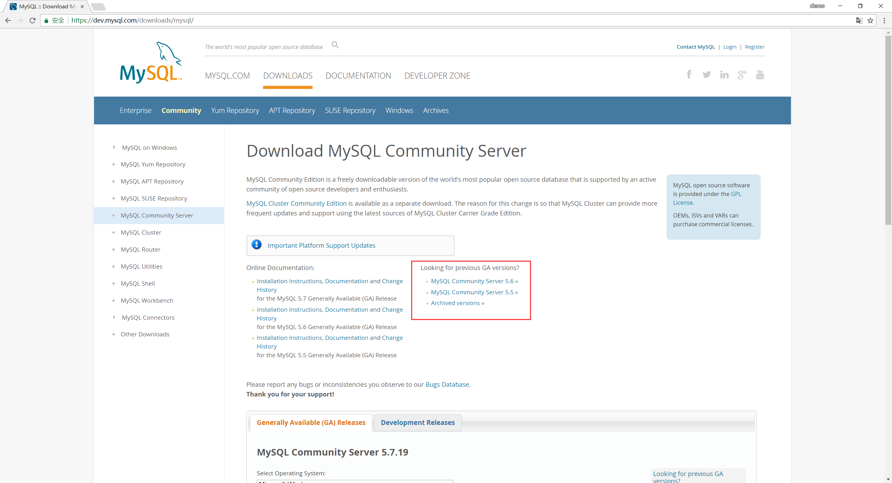
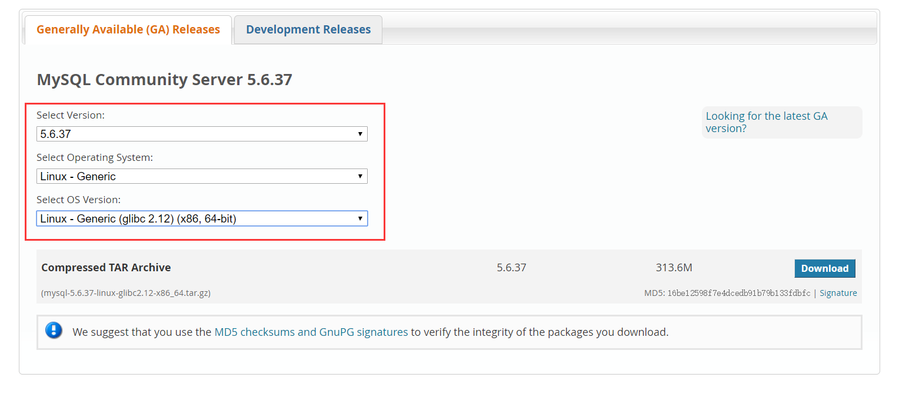

# MySQL安装

# 学习

> MySQL官网 [https://www.mysql.com](https://www.mysql.com/)
>
> MySQL工程师的博客 [https://dev.mysql.com](https://dev.mysql.com/)
>
> Planet MySQL [https://planet.mysql.com](https://planet.mysql.com/)
>
> MySQL Bugs [https://bugs.mysql.com](https://bugs.mysql.com/)
>
> Worklog(类似工作日志) https://dev.mysql.com/worklog/
>
> 这些网站应该天天逛

# 环境

> VirtualBox + CentOS6

# 基础软件部署

## 1.下载

[https://dev.mysql.com/downloads/mysql/](https://dev.mysql.com/downloads/mysql/)







> 说明：
>
> 推荐Linux - Generic
>
> 教程中用的5.6.27
>
> 当前时间20171002的5.6的最新版本是5.6.37
>
> 得到下载链接
> [https://cdn.mysql.com//Downloads/MySQL-5.6/mysql-5.6.37-linux-glibc2.12-x86_64.tar.gz](https://cdn.mysql.com//Downloads/MySQL-5.6/mysql-5.6.37-linux-glibc2.12-x86_64.tar.gz)
>
> 搜狐的镜像
> [http://mirrors.sohu.com/](http://mirrors.sohu.com/)


```shell
# 镜像里5.6.36是最新的
http://mirrors.sohu.com/mysql/MySQL-5.6/mysql-5.6.36-linux-glibc2.5-x86_64.tar.gz
# 先下载到本地再上传文件至服务器
rz -y
# 或者直接下载到服务器
wget https://cdn.mysql.com//Downloads/MySQL-5.6/mysql-5.6.37-linux-glibc2.12-x86_64.tar.gz
```

## 2. 解压

帮助手册：[https://dev.mysql.com/doc/refman/5.6/en/](https://dev.mysql.com/doc/refman/5.6/en/)

```shell
# 创建目录
mkdir -p /opt/mysql

# 解压文件到/opt/mysq/目录下
tar -xzvf mysql-5.6.37-linux-glibc2.12-x86_64.tar.gz -C /opt/mysql/

# 查看解压后MySQL占用空间
du -sh *

# 删除链接用unlink
unlink /usr/local/mysql

# 建立链接
ln -s /opt/mysql/mysql-5.6.37-linux-glibc2.12-x86_64 /usr/local/mysql
cp /usr/local/mysql/support-files/mysql.server /etc/init.d/mysql
```

## 3. 创建用户

```shell
# 确保有mysql账户
id mysql
groupadd mysql
useradd -g mysql -s /sbin/nologin -M mysql
```

## 4. 环境变量

```shell
# 配置环境变量，并使配置生效
echo 'export PATH=/usr/local/mysql/bin:$PATH' >> /etc/profile
source /etc/profile

# 查看mysql都在哪
whereis mysql
```

## 常用命令

```shell
mysql
mysqlbinlog
mysqld
mysqld_safe
perror
mysqldump
mysql_upgrade
/usr/loca/mysql
```

# 启动起来

## 5. 创建必须的目录

```shell
# 一般是项目名加端口号或直接端口号 eg:yyms3306 or 3306
mkdir -p /data/mysql/mysql3376/{data,tmp,logs}
```

## 6. 修改权限

```shell
# 权限
chown -R mysql:mysql /data/mysql/mysql3376
chown -R mysql:mysql /opt/mysql
chown -R mysql:mysql /usr/local/mysql
```

## 7. 创建配置文件

```shell
# 配置文件
# /etc/my.cnf
# innodb_data_file_path=ibdata1:100M:autoextend  数据字典
```

## 8. 初始化

```shell
# 执行如下安装命令初始化，如果不指定配置文件，要切换到下面目录下执行安装命令
cd /usr/local/mysql
./scripts/mysql_install_db
# ./scripts/mysql_install_db --defaults-file=/etc/my.cnf
# 看到2个OK就表示成功
```

## 9. 启动关闭

```shell
# 启动，有n种方式，如下：
/etc/init.d/mysql start
service mysql start
/usr/local/mysql/bin/mysqld_safe --defaults-file=/etc/my.cnf &
/usr/local/mysql/bin/mysqld --defaults-file=/etc/my.cnf &

# 关闭
/etc/init.d/mysql stop
service mysql stop
/usr/local/mysql/bin/mysqladimn -S /tmp/mysql3376.sock shutdown
```

## 10. 安全加固

```shell
# 登录,此处的mysql /usr/local/mysql/bin/mysql
mysql -uroot -S /tmp/mysql3376.sock

# 查看当前用户
select user, host, authentication_string from mysql.user;

# 删除多余账户及数据库、表
delete from mysql.user where user!='root' or host!='localhost';
truncate table mysql.db;
drop database test;

# 更新root密码
update mysql.user set authentication_string = password('123456') where user='root';
flush privileges

# 当前目录是/usr/local/mysql
./bin/mysql_secure_installation
```

## 11. 确认MySQL启动

```shell
# 查看进程  ef与aux
ps -ef|grep -v "grep"|grep mysqld

# 查看监听
netstat -nalp|grep mysqld
ss -lnpt|grep mysqld
lsof -i :3376

# 看错误日志
tail -f /data/mysql/mysql3376/error.log
```


/etc/security/limits.conf