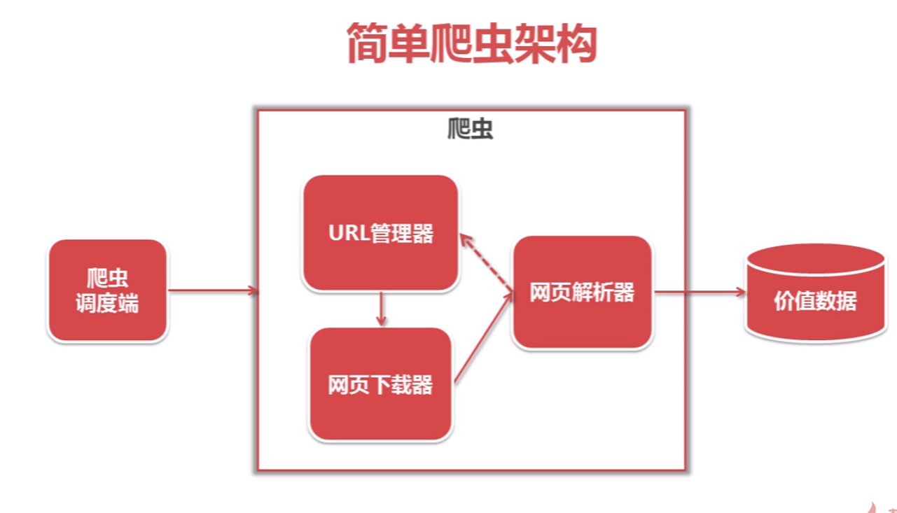
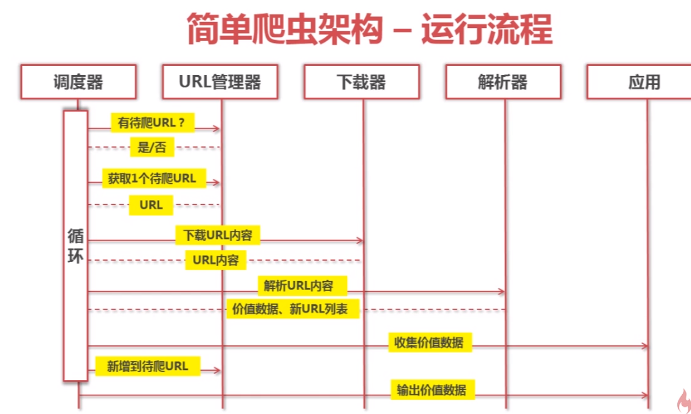

Python开发简单爬虫

Python2.7

# 简单爬虫架构

## 爬虫架构




## 运行流程



# URL管理器

# 页面下载器urllib2

# 页面解析器BeautifulSoup

安装

```shell
pip install bs4
```

# 完整实例  

[爬取百度百科词条](https://gitee.com/yysue/tutorial/tree/master/python/samples/simple_spider)

