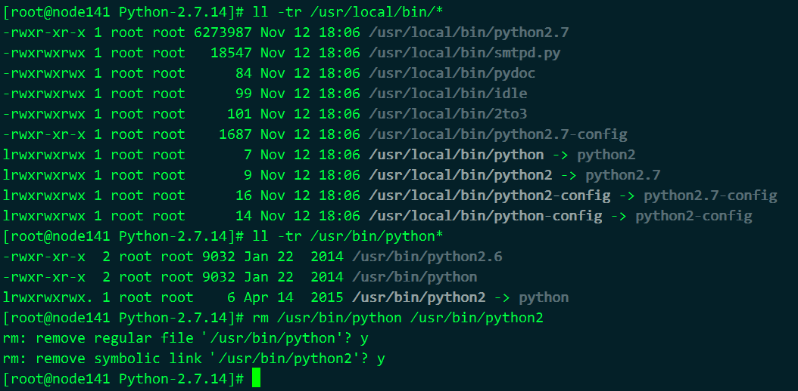
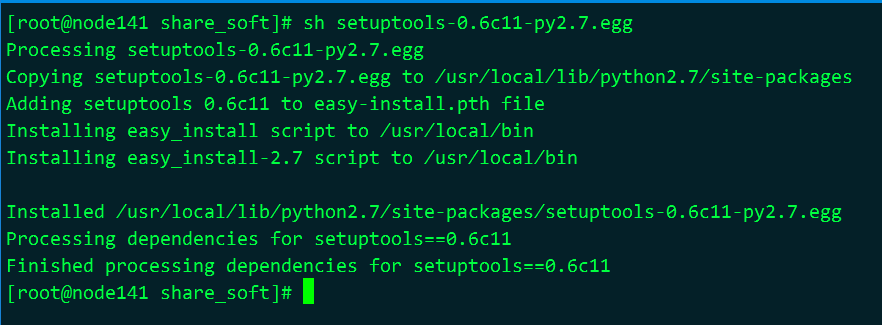

#  CentOS6.8 Python升级到Python2.7

**查看Python版本**

```shell
python --version
python -V
```

**查看CentOS版本**

```shell
cat /etc/redhat-release
```

**安装所有的开发工具包及其它必需的包**

```shell
yum groupinstall "Development tools" -y
yum install zlib-devel bzip2-devel openssl-devel ncurses-devel sqlite-devel -y
```

**下载最新的Python2.x**

```shell
# https://www.python.org/downloads/
wget https://www.python.org/ftp/python/2.7.14/Python-2.7.14.tgz
tar -xavf Python-2.7.14.tgx
cd Python-2.7.14
./configure
make && make install
```

**后续处理**

```shell
# 默认安装在/usr/local/bin目录下
[ysai@www Python-2.7.14]$ ll -tr /usr/local/bin/*
-rwxrwxr-x. 1 root root   18547 Oct 10 21:52 /usr/local/bin/smtpd.py
-rwxrwxr-x. 1 root root      84 Oct 10 21:52 /usr/local/bin/pydoc
-rwxrwxr-x. 1 root root      99 Oct 10 21:52 /usr/local/bin/idle
-rwxrwxr-x. 1 root root     101 Oct 10 21:52 /usr/local/bin/2to3
-rwxr-xr-x. 1 root root 6273979 Oct 10 21:54 /usr/local/bin/python2.7
-rwxr-xr-x. 1 root root    1687 Oct 10 21:55 /usr/local/bin/python2.7-config
lrwxrwxrwx. 1 root root       7 Oct 10 21:55 /usr/local/bin/python -> python2
lrwxrwxrwx. 1 root root       9 Oct 10 21:55 /usr/local/bin/python2 -> python2.7
lrwxrwxrwx. 1 root root      16 Oct 10 21:55 /usr/local/bin/python2-config -> python2.7-config
lrwxrwxrwx. 1 root root      14 Oct 10 21:55 /usr/local/bin/python-config -> python2-config
[ysai@www Python-2.7.14]$ ll -tr /usr/bin/python*
-rwxr-xr-x. 2 root root 9032 Jul 24  2015 /usr/bin/python2.6
-rwxr-xr-x. 2 root root 9032 Jul 24  2015 /usr/bin/python
lrwxrwxrwx. 1 root root    6 May 30 19:33 /usr/bin/python2 -> python

# 做如下处理
rm /usr/bin/python /usr/bin/python2
ln -s /usr/local/bin/python /usr/bin/python
```

 

**fix:python2.7对yum有影响**

```shell
vi /usr/bin/yum
# 将第一行解释器修改成用python2.6来解析
#!/usr/bin/python
# 改成这样
#!/usr/bin/python2.6

# yum升级咋办
```

**安装setuptools**

```shell
# easy_install命令被安装在/usr/local/bin目录下
wget https://bootstrap.pypa.io/ez_setup.py -O - | python
```

**本地安装setuptools**

[setuptools-0.6c11-py2.7.egg](https://mirrors.ustc.edu.cn/pypi/web/packages/25/5d/cc55d39ac39383dd6e04ae80501b9af3cc455be64740ad68a4e12ec81b00/setuptools-0.6c11-py2.7.egg#md5=fe1f997bc722265116870bc7919059ea)

```shell
sh setuptools-0.6c11-py2.7.egg
```



**使用镜像**

科大镜像 https://lug.ustc.edu.cn/wiki/mirrors/help/pypi

豆瓣镜像 [ttps://pypi.douban.com/simple/](https://pypi.douban.com/simple/) 

官方插件 https://pypi.python.org/pypi

PyPI Official Mirrors: <https://pypi.python.org/mirrors>

PEP-381 Mirroring Protocol: <http://www.python.org/dev/peps/pep-0381/>

bandersnatch: <https://pypi.python.org/pypi/bandersnatch>

```shell
# 使用镜像源很简单，用-i指定就行了
easy_install -i https://pypi.douban.com/simple/ pip
```

**如何使用科大 mirrors 加速 pip**

~/.pip/pip.conf

```shell
[global]
index-url = https://mirrors.ustc.edu.cn/pypi/web/simple
format = columns
```

**安装pip**

```shell
# pip命令被安装在/usr/local/bin目录下了
easy_install pip
```

