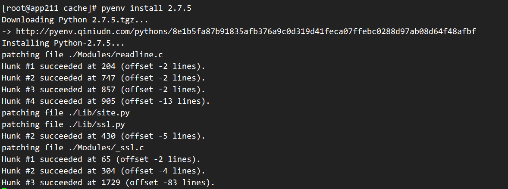
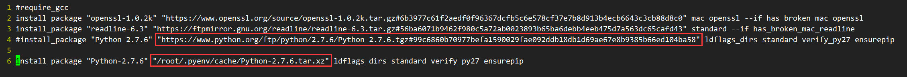
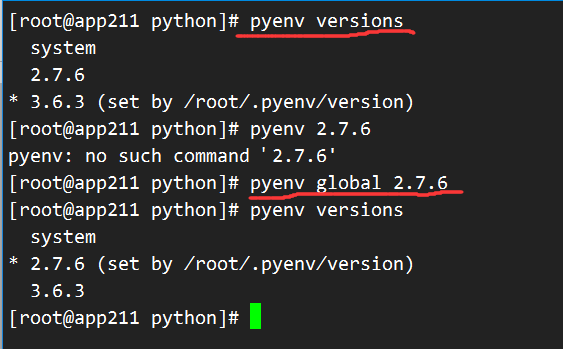
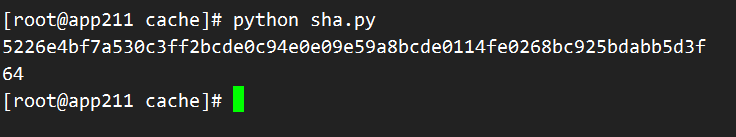
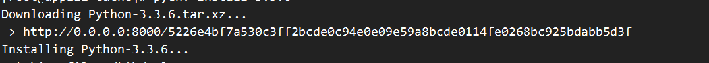

pyenv默认从 https://www.python.org/ftp/python/3.6.3/Python-3.6.3.tgz下载安装包，国内速度慢

https://www.python.org/downloads/

https://www.python.org/ftp/python/2.7.6/Python-2.7.6.tar.xz

# 方案一：使用镜像加速

七牛镜像 http://pyenv.qiniudn.com/pythons/

```shell
# 设置镜像URL变量
export PYTHON_BUILD_MIRROR_URL="http://pyenv.qiniudn.com/pythons/"

# 安装2.7.5
pyenv install 2.7.5 -v
```

 

# 方案二：本地安装

以安装Python2.7.6版本为例

pyenv的安装路径：/root/.pyenv/

对应的python-build路径：/root/.pyenv/plugins/python-build/

安装python的指令在：/root/.pyenv/plugins/python-build/share/python-build/

pyenv的安装原理， 其实它是利用了python-build工具，从python官网下载python包，然后安装。

## 下载安装包

https://www.python.org/downloads/

https://www.python.org/ftp/python/2.7.6/Python-2.7.6.tar.xz

```
# 将安装包拷贝到pyenv下的cache目录下
cp Python-2.7.6.tar.xz /root/.pyenv/cache/
```

## 修改安装指令



```shell
# vi修改
vi /root/.pyenv/plugins/python-build/share/python-build/2.7.6

# 其实就是将第4行的下载安装包的url替换成你本地的安装包的路径
```

 ## 安装

```shell
pyenv install 2.7.6 -v

# -v参数：显示安装过程
```

## 安装后

```shell
# 查看版本
pyenv versions

# 重置SHELL环境
exec $SHELL

# 设置要使用的python版本
pyenv global 2.7.6
```

 

# 方案三：自己开启一个镜像

## 下载安装包

这次安装3.3.7

https://www.python.org/ftp/python/3.3.6/Python-3.3.6.tar.xz

```shell
# 将安装包拷贝到pyenv下的cache目录下
cp Python-3.3.6.tar.xz /root/.pyenv/cache/
```

## 重命名安装包

重命名成64位sha码

```python
# -*- coding:utf-8 -*-
import os
import hashlib
import sys
__author__ = 'dave'
def get_hash(filepath):
    if not os.path.exists(filepath):
        print('File not exists.')
        return
    # algo = hashlib.md5()
    algo = hashlib.sha256()
    with open(filepath, 'rb') as f:
        while True:
            data = f.read(4096)
            if not data:
                break
            algo.update(data)
    return algo.hexdigest()
if __name__ == '__main__':
    md5sum = get_hash('Python-3.3.6.tar.xz')
    print(md5sum)
    print(len(md5sum))
```

把上述文件保存成sha.py

```shell
# 执行脚本得到哈希码
python sha.py
# 5226e4bf7a530c3ff2bcde0c94e0e09e59a8bcde0114fe0268bc925bdabb5d3f

# 重命名
mv Python-3.3.6.tar.xz 5226e4bf7a530c3ff2bcde0c94e0e09e59a8bcde0114fe0268bc925bdabb5d3f
```



## 设置镜像地址

```shell
export PYTHON_BUILD_MIRROR_URL="http://127.0.0.1:8000/"
# or
export PYTHON_BUILD_MIRROR_URL="http://0.0.0.0:8000/"
```

## 开启服务

```shell
# 一定要切换到包含镜像的目录下执行如下命令
cd ~/.pyenv/cache/

# python3
python -m http.server
# python2
python -m SimpleHTTPServer
```

## 安装

```shell
# 再打开一个终端窗口
pyenv install 3.3.6
```

 

# 参考

1. [pyenv进行python版本本地安装](http://blog.csdn.net/windeal3203/article/details/53413479)
2. [pyenv使用镜像加速](https://ficapy.github.io/2016/07/15/pyenv_use_mirror/)


[Python离线工作环境搭建](http://votec.top/2017/01/01/python-pip-note/)

[python的pip和virtualenv使用心得](http://blog.csdn.net/u011860731/article/details/46573135)

[搭建本地pypi服务](http://www.worldhello.net/2011/03/14/2357.html)

[python pip对它本地目录安装相关程序包](http://blog.csdn.net/u011860731/article/details/46573143)


